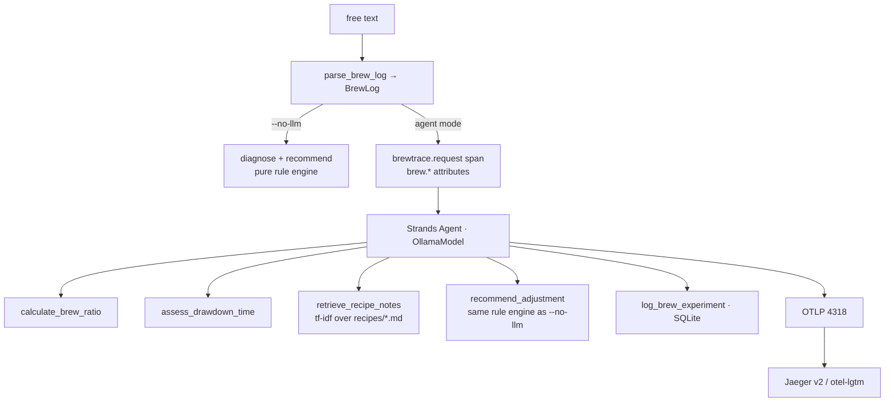

# Architecture

## Design invariant

All domain logic lives in pure, typed, LLM-free functions. The `@tool` wrappers are
3-5 lines each, and the agent is a routing layer over them. Consequences:

- `uv run pytest` exercises every diagnosis rule without a model or a collector.
- The evals are deterministic: the rule engine either matches the case table or it doesn't.
- The agent's only real job — visible in every trace — is choosing tools and reading
  their output. When it recommends something the rule engine wouldn't, the trace shows
  exactly where it went off script.



## Observed trace shape

What a single diagnosis actually looks like in Jaeger (strands-agents 1.46.0, qwen3):

```
brewtrace.request                       55.2s   ← manual span (telemetry.py)
│   brew.method=v60  brew.dose_g=16  brew.water_g=250  brew.ratio=15.62
│   brew.temperature_c=94  brew.drawdown_seconds=225  taste.primary_defect=sour_thin
└── invoke_agent Strands Agents         43.2s   ← Strands auto-instrumentation
    │   gen_ai.agent.tools=[...6 tools]  gen_ai.request.model=qwen3
    └── execute_event_loop_cycle        35.2s
        ├── chat                        35.2s   ← model call, token usage attrs
        ├── execute_tool calculate_brew_ratio     6ms
        ├── execute_tool assess_drawdown_time     ...
        ├── execute_tool retrieve_recipe_notes    ...
        └── execute_tool recommend_adjustment     ...
    └── execute_event_loop_cycle                ← second cycle: final answer
```

A second, smaller `invoke_agent` trace follows each diagnosis: the structured-output
extraction pass (see below).

## Custom attribute namespaces

Custom attributes use our own namespaces — `brew.*`, `taste.*`, `eval.*` — never
`gen_ai.*`. OTel naming guidance reserves existing namespaces for the spec; a future
revision could claim any name we squatted on.

The `brewtrace.request` attributes come from the deterministic parser, which runs even
in agent mode. The parse is what makes traces queryable: in Jaeger you can filter on
`taste.primary_defect=sour_thin` or `eval.passed=false` regardless of what the model did.

## GenAI semantic conventions: what Strands actually emits

The OTel GenAI semantic conventions are still Development-status, and the attribute
names changed in 2025-26 (`gen_ai.system` → `gen_ai.provider.name`,
`gen_ai.usage.prompt_tokens` → `gen_ai.usage.input_tokens`). Observed behavior of
strands-agents 1.46.0:

- Emits the legacy `gen_ai.system=strands-agents` (not `gen_ai.provider.name`).
- Emits token usage under **both** generations of names: `gen_ai.usage.prompt_tokens`
  *and* `gen_ai.usage.input_tokens` (same value), likewise completion/output.
- Span names follow the current conventions: `invoke_agent`, `chat`,
  `execute_tool <name>`.
- **Metrics do not follow the GenAI conventions at all.** The spec defines
  `gen_ai.client.token.usage` and `gen_ai.client.operation.duration`; what arrives in
  Prometheus is `strands_event_loop_input_tokens_token_*`,
  `strands_event_loop_cycle_duration_seconds_*`, `strands_tool_call_count_Count_total`,
  `strands_tool_duration_seconds_*`, `strands_model_time_to_first_token_milliseconds_*`,
  and friends.

Write dashboard queries against both span-attribute name generations, build metric
dashboards on the `strands_*` names, or pin your strands version.
`OTEL_SEMCONV_STABILITY_OPT_IN=gen_ai_latest_experimental` opts into newer behavior
where supported.

## Two-pass structured output

Small local models routinely fail Strands' forced structured-output tool call when it
lands at the end of a long tool loop (llama3.1-8B fails nearly every time). So
`run_diagnosis()` makes two passes:

1. The tool-using agent answers in prose.
2. A tool-free extraction agent converts that answer into the `BrewAdvice` model.

The extraction pass costs one short LLM call and shows up in traces as its own
`invoke_agent` span. `BrewAdvice` mirrors the rule engine's `Adjustment` fields
(variable + direction), so the eval scorer handles both modes with one code path.

## Model choice

`qwen3` (default) reliably walks the four-tool workflow. `llama3.1` handles single
explicit tool requests but usually skips tools on open-ended prompts and answers from
its own coffee knowledge — the eval harness (`run_evals --agent --model llama3.1`)
quantifies the difference. Any tool-capable Ollama model works via `--model`.
